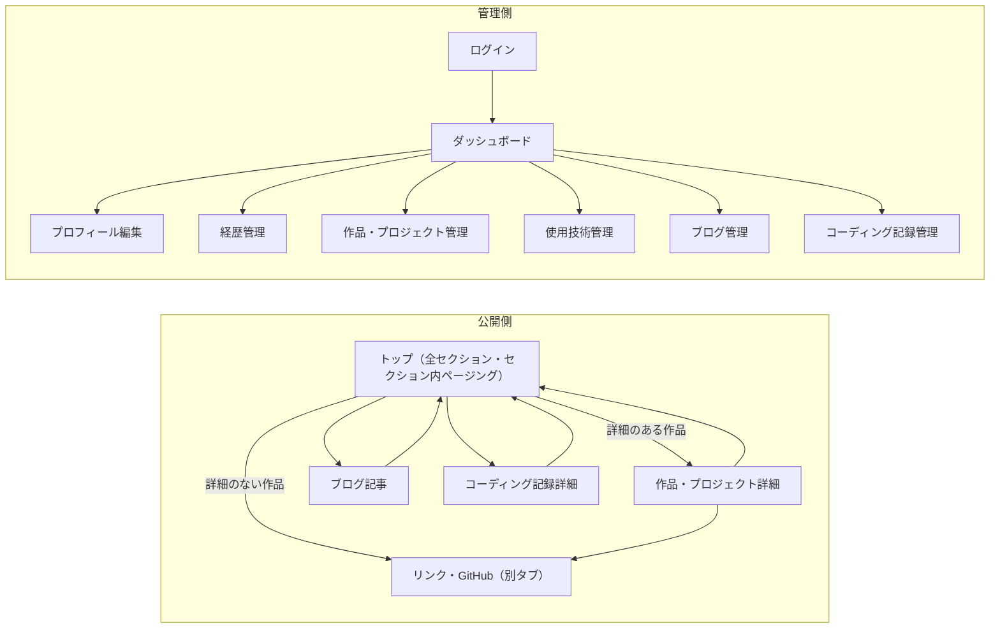

# 壁打ちメモ(Phase 1 成果物)

## スコープ

フル機能。レジュメ・ブログ・コーディング記録・自作CMSをすべてそろえてから、一度に公開する。
推奨案の2段階リリース（第1弾: レジュメ＋ブログ＋CMS、第2弾: コーディング記録）ではなく、ユーザーの判断で一括公開を選んだ。

## 公開側の見せ方の原則

- 画面遷移しなくても、トップの1ページだけで何者かがわかるようにする。
- 別ページに移るのは、詳細（作品・プロジェクト詳細、ブログ記事、コーディング記録詳細）を見るときだけ。
- 件数が多いセクション（経歴、作品・プロジェクト、ブログ、コーディング記録）は、セクションの中でページングする。数件ずつのまとまりで表示し、「◀ 1 / 3 ▶」のような操作でまとまりを切り替える。ページ（URL）は移らず、切り替わるのはそのセクションの中身だけ。

## ロール定義

| ロール | 説明 | 権限 |
|--------|------|------|
| 訪問者 | 採用担当・リクルーター、フリーランスの依頼主、エンジニア仲間など、サイトを見に来る人 | 公開側の全画面を閲覧できる（ログイン不要） |
| 管理者 | サイトの持ち主（自分）1人 | CMSにログインし、すべてのコンテンツを作成・編集・公開・削除できる |

## コアフロー

「何者かつかみ、作品で確かめる」（訪問者）

`トップで経歴の要点をつかむ → 同じページの作品・プロジェクト欄をセクション内でページングして見る → 作品・プロジェクト詳細（背景・工夫・使用技術・画像）→ リンクやGitHubで実物を確かめる`

詳細ページは必須ではない。詳細本文を書いた作品だけが詳細ページを持ち、詳細のない作品はトップの作品欄からリンクやGitHubへ直接進む。
詳細ページを用意するのは、「作品で信頼できる」体験には背景や工夫まで読める場所が要るため。

## 画面一覧

| 画面名 | 目的 | 簡易説明 | 対象ロール | 認証 |
|--------|------|----------|-----------|------|
| トップ | 遷移せずに何者かわかる | 1ページに全セクションを載せる: プロフィール、経歴（職歴・学歴）、使用技術、作品・プロジェクト、ブログ、コーディング記録。件数が多いセクションはセクション内でページング | 訪問者 | 不要 |
| 作品・プロジェクト詳細 | 作品で実力を確かめられる | 背景・工夫・使用技術・画像と、リンク・GitHubへの入口。詳細本文がある作品にだけ存在する | 訪問者 | 不要 |
| ブログ記事 | 人となりが伝わる | 記事を読む | 訪問者 | 不要 |
| コーディング記録詳細 | 学びの過程が伝わる | 1件の記録を読む | 訪問者 | 不要 |
| ログイン | 管理者だけが入る | 管理者アカウントでログインする | 管理者 | 不要 |
| ダッシュボード | 管理作業の起点 | 各コンテンツへの入口と、下書きの一覧 | 管理者 | 必要 |
| プロフィール編集 | プロフィールを更新する | 名前・写真・自己紹介・SNSリンク | 管理者 | 必要 |
| 経歴管理 | 経歴を更新する | 職歴・学歴の一覧と編集 | 管理者 | 必要 |
| 作品・プロジェクト管理 | 作品を更新する | 一覧と編集（詳細ページの本文・画像を含む） | 管理者 | 必要 |
| 使用技術管理 | 技術スタックを更新する | 使用技術の一覧と編集 | 管理者 | 必要 |
| ブログ管理 | 記事を書いて公開する | 記事の一覧と、エディタ・プレビュー・公開 | 管理者 | 必要 |
| コーディング記録管理 | 記録を書いて公開する | 記録の一覧と編集・プレビュー・公開 | 管理者 | 必要 |

- 公開側は4画面（トップ＋詳細3種）、管理側は8画面。
- 公開側の画面は、すべて日本語と英語を切り替えられる。
- レジュメ・作品一覧・ブログ一覧・コーディング記録一覧は、独立した画面にせず、トップのセクションとして持つ。

## 画面遷移の全体像

### 公開側（ログイン不要）

- トップ内の移動: ヘッダーのメニュー（プロフィール／経歴／使用技術／作品／ブログ／コーディング記録）を押すと、トップの該当セクションへスクロールする。ページは移らない
- 各セクションの続きは、ページを移らずにセクション内のページングで見る
- トップの作品カード → 作品・プロジェクト詳細（詳細のない作品は、リンク・GitHubを別タブで直接開く）
- 作品・プロジェクト詳細 → リンク・GitHub（別タブで開く）
- トップのブログカード → ブログ記事
- トップのコーディング記録カード → コーディング記録詳細
- 各詳細ページ → トップの該当セクションへ戻る。作品・プロジェクト詳細からは、前後の作品にも移れる
- 日英を切り替えても、今いる画面のまま言語だけが変わる

### 管理側（ログイン必要）

- 管理画面のURLを開く → ログインしていなければログイン画面へ → ダッシュボード
- ダッシュボード → 各管理画面（サイドメニューで行き来できる）
- 各管理画面: 一覧 → 編集 → 保存（ブログとコーディング記録は、プレビュー → 公開）→ 一覧へ戻る
- ログアウト → ログイン画面

### 分岐条件

- 公開側はログイン不要。管理側はログイン画面を除いてすべてログインが必要。
- 公開サイトには、管理画面への入口を置かない（管理画面はURLを直接開いて入る）。
- 作品・プロジェクトは、詳細本文があれば詳細ページへ、なければリンク・GitHubへ直接進む。

## データ構造(概要)

| エンティティ | 中身 | 関係 |
|---|---|---|
| プロフィール | 名前、写真、自己紹介、SNSリンク | サイト全体で1件（自分） |
| 経歴 | 種類（職歴／学歴）、所属、期間、内容 | — |
| 作品 | 種類（作品／プロジェクト）、概要、詳細本文、画像、期間、リンク、GitHub | 使用技術と多対多 |
| 使用技術 | 名前、アイコン、リンク | 作品と多対多 |
| ブログ記事 | タイトル、本文、公開状態（下書き／公開）、公開日 | — |
| コーディング記録 | タイトル、本文、公開状態（下書き／公開）、公開日 | — |
| 管理者 | ログイン用のアカウント | 1人 |

- 文章の項目は、すべて日本語と英語の両方を持つ。
- 今のDBでは「職歴と学歴（Experience／Education）」「作品とプロジェクト（Work／Project）」が別テーブルだが、管理画面が1つずつなのに合わせて、それぞれ種類で分ける1つのエンティティにまとめる。
- 作品の詳細本文と画像は任意。詳細本文があるときだけ詳細ページを出す。
- 今のサイトのデータは、公開サイト（https://eastasian.vercel.app/）から抽出して、この形に移す。
- カラム定義は Phase 2 で詰める。

## 保留事項・未決定事項

- コーディング記録に何をどう載せるか（学習ログ、コード断片など）→ Phase 2
- 日英のURLの持ち方 → Phase 2
- セクション内ページングの細部: 1ページあたりの件数、操作の形（矢印・ページ番号・ドット、スマホでのスワイプ）、並び順（最初のページに出す作品・記事の決め方）→ Phase 2
- 技術スタック → Phase 3
- 今のデータの抽出: この環境のネットワーク設定で `eastasian.vercel.app` と、画像の置き場の `plmzmwpmjruswencnerh.supabase.co` がブロックされている。許可されたら、ページに埋め込まれたデータ（`__NEXT_DATA__`）から抽出する
